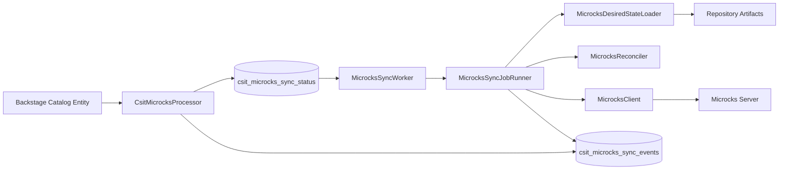

# CSIT Microcks Backend Plugin

This Backstage backend plugin synchronizes API mocks defined in a repository into a **Microcks** server.

The plugin reads configuration from catalog entities, determines the desired state of mocks, and reconciles Microcks so that the correct mock services exist.

The system is intentionally designed to be **deterministic**, **observable**, and **fail fast**.

---

# Architecture



### Flow Summary

1. A catalog entity references a `microcks.yaml` file.
2. The **Catalog Processor** reads this file and records desired sync state.
3. The **Background Worker** polls the database for pending jobs.
4. Each job is executed by the **Job Runner**.
5. The job runner loads artifacts, reconciles Microcks services, and records events.

Both the **processor** and **worker** emit events for observability.

---

# Developer Workflow

This section describes what happens when a developer updates `microcks.yaml` in a repository.

Understanding this flow helps when debugging synchronization behavior.

---

## Step 1 — Developer Updates microcks.yaml

A developer modifies the mock configuration referenced by a catalog entity.

Example changes:

- add a new mock
- update OpenAPI
- add example responses
- remove a mock

The change is committed to the repository.

---

## Step 2 — Backstage Catalog Processing

During the next catalog refresh:

`CsitMicrocksProcessor`

runs for the entity.

The processor:

1. Detects the annotation

```
bcgov/microcks-config-ref
```

2. Loads the `microcks.yaml` file.
3. Parses mock definitions.
4. Computes a **fingerprint hash** of inputs.
5. Upserts rows in:

```
csit_microcks_sync_status
```

### Possible outcomes

| Scenario | Result |
|--------|--------|
| New mock | `desired_action = reconcile` |
| Updated configuration | `desired_action = reconcile` |
| Removed mock | `desired_action = delete` |
| No changes | no new job created |

The processor **does not communicate with Microcks**.

Its responsibility is to determine **desired state** and record synchronization jobs.

Processor activity is also recorded in the event table for observability.

---

## Step 3 — Job Appears in Database

Example record:

| field | value |
|-----|------|
| entity_ref | component:default/my-api |
| mock_id | default |
| desired_action | reconcile |
| microcks_version_id | bk-8ad514d6fc316e04-default |
| status | pending |

The record waits to be claimed by the worker.

---

## Step 4 — Worker Claims the Job

`MicrocksSyncWorker` periodically polls the database.

The worker:

1. checks configuration
2. verifies global backoff is not active
3. claims a job using a **lease**

```
claimNextPending()
```

The job status transitions to **leased**.

---

## Step 5 — Job Runner Executes the Sync

Execution is delegated to:

```
MicrocksSyncJobRunner
```

The runner performs the following steps.

---

### 1) Load Desired State

```
MicrocksDesiredStateLoader
```

Loads:

- OpenAPI specification
- example artifacts
- metadata

Artifacts may come from:

- repository files
- URLs

---

### 2) Scan Existing Microcks Services

The runner scans Microcks for services owned by the entity.

Ownership is determined using:

```
bk-<entityHash>
```

Example:

```
bk-8ad514d6fc316e04-*
```

---

### 3) Reconcile Desired vs Existing

`MicrocksReconciler` determines:

- services owned by the entity
- exact version matches
- services to delete
- whether action is:

```
create
or
update
```

---

### 4) Upload Artifacts

Artifacts are uploaded using:

```
MicrocksClient.uploadArtifacts()
```

Before upload:

```
MicrocksArtifactIdentityStamper
```

injects deterministic identity metadata.

---

### 5) Delete Stale Services

Any services owned by the entity that are not part of the desired version set are deleted.

This ensures:

```
Microcks always reflects the desired configuration
```

---

## Step 6 — Job Completion

If successful:

```
status = completed
```

The worker records events in:

```
csit_microcks_sync_events
```

Example events:

- reconcile_started
- artifact_upload_started
- artifact_upload_finished
- reconcile_finished

---

# Overview

The plugin consists of two main components.

---

## 1. Catalog Processor

Class:

`CsitMicrocksProcessor`

Runs during Backstage catalog entity processing.

### Responsibilities

- Detect the annotation

```
bcgov/microcks-config-ref
```

- Load a `microcks.yaml` file from the entity repository or URL
- Parse mock definitions
- Compute a fingerprint of configuration inputs
- Upsert synchronization records in the database
- Mark removed mocks as delete operations
- Add mock server links to the entity metadata

The processor **never calls Microcks directly**.

Instead it determines desired state and records synchronization jobs.

The processor also records **events describing configuration changes**.

Example processor events:

- processor.config_loaded
- processor.fingerprint_changed
- processor.mock_discovered
- processor.mock_removed
- processor.sync_record_created

---

## 2. Background Worker

Class:

`MicrocksSyncWorker`

Runs periodically inside the Backstage backend.

### Responsibilities

- Poll the database for pending sync records
- Claim jobs using a lease
- Acquire authentication tokens
- Execute reconciliation jobs
- Handle global backoff for infrastructure failures

Actual job execution is handled by:

```
MicrocksSyncJobRunner
```

This separation keeps the worker focused on **orchestration**.

Worker events include:

- worker.reconcile_started
- worker.reconcile_plan
- worker.artifact_upload_started
- worker.service_delete_started
- worker.reconcile_finished
- worker.failed
- worker.global_backoff

---

# Configuration

Backstage `app-config.yaml` must define a Microcks server.

Example:

```yaml
csitMicrocks:
  baseUrl: https://microcks.example.com
  auth:
    type: keycloak
    tokenUrl: https://keycloak.example.com/realms/example/protocol/openid-connect/token
    clientId: backstage
    clientSecret: ${MICROCKS_CLIENT_SECRET}
```

If this configuration is missing:

- The processor continues queuing jobs
- The worker **will not claim jobs**

---

# Entity Configuration

Catalog entities enable Microcks synchronization using the annotation:

```
bcgov/microcks-config-ref
```

Example:

```yaml
metadata:
  annotations:
    bcgov/microcks-config-ref: ./microcks.yaml
```

The referenced file defines one or more mocks.

Example structure:

```yaml
spec:
  mocks:
    - mockId: default
      openapi:
        path: openapi.yaml
      artifacts:
        - kind: examples
          path: examples
```

Artifacts may reference:

- local repository paths
- URLs

Multiple mocks per API are supported.

---

# Versioning Model

Microcks service versions are deterministic.

Format

```
bk-<entityHash>-<mockId>
```

Example

```
bk-8ad514d6fc316e04-default
bk-8ad514d6fc316e04-swagger
bk-8ad514d6fc316e04-sdpr
```

Ownership of services is determined by the prefix:

```
bk-<entityHash>
```

The worker scans Microcks for services with this prefix to determine ownership.

---

# Reconciliation Model

Reconciliation is handled by:

```
MicrocksReconciler
```

It determines:

- whether a service must be created or updated
- which services are owned by the entity
- which services must be deleted
- whether an exact version already exists

The worker ensures that **only the desired versions exist in Microcks**.

---

# Fail Fast Behavior

The system intentionally **fails fast and loud**.

If desired state cannot be loaded (for example missing artifacts or invalid paths):

The worker will:

1. Record a failure event
2. Delete all Microcks services owned by the failed mock
3. Mark the sync record as `error`

This prevents a broken configuration from leaving a stale working mock in Microcks.

Cleanup **only deletes services belonging to the failed mock**.

Other mocks belonging to the same API entity remain untouched.

---

# Database Tables

## csit_microcks_sync_status

Tracks synchronization jobs.

Important fields:

| Field | Description |
|------|-------------|
| id | primary key |
| entity_ref | Backstage entity reference |
| mock_id | mock identifier |
| desired_action | reconcile or delete |
| microcks_version_id | deterministic Microcks version |
| fingerprint_hash | processor fingerprint |
| status | pending, completed, error |
| attempt_count | retry count |
| next_attempt_at | retry scheduling |
| last_attempt_at | last execution time |
| leased_at | worker lease start |
| lease_expires_at | lease expiration |
| last_success_at | last successful sync |
| last_message | status message |

---

## csit_microcks_sync_events

Stores detailed sync history.

| Field | Description |
|------|-------------|
| entity_ref | entity reference |
| mock_id | mock identifier |
| sync_status_id | sync record id |
| event_type | event category |
| level | info or error |
| message | event message |
| details_json | structured event details |
| created_at | timestamp |

Both the **processor** and the **worker** record events to this table.

---

# Important Classes

| Class | Responsibility |
|------|---------------|
| `CsitMicrocksProcessor` | Reads entity configuration and queues sync jobs |
| `MicrocksSyncWorker` | Polls database and orchestrates job execution |
| `MicrocksSyncJobRunner` | Executes a single sync job |
| `MicrocksDesiredStateLoader` | Loads artifacts from repositories or URLs |
| `MicrocksClient` | Communicates with the Microcks API |
| `MicrocksReconciler` | Determines required create/update/delete actions |
| `MicrocksTokenProvider` | Handles authentication tokens |
| `MicrocksArtifactIdentityStamper` | Injects deterministic version identity into artifacts |
| `MicrocksSyncStore` | Database access layer |

---

# Design Principles

### Deterministic Versioning

Microcks service versions are derived from entity identity and mockId.

### Fail Fast Behavior

Invalid configuration immediately removes owned mocks.

### Explicit Ownership

The entity version prefix determines service ownership.

### Observable Operations

All actions emit events to `csit_microcks_sync_events`.

### Small Focused Components

Worker orchestration, job execution, reconciliation, and storage are separated into distinct classes.